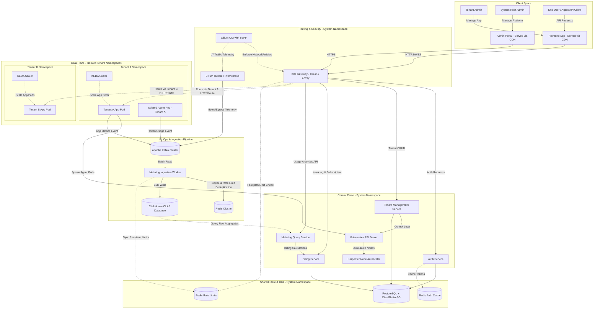

# High-Availability Multi-Tenant SaaS Infrastructure Platform

Enterprise-grade, high-availability infrastructure boilerplate designed for B2B SaaS applications. Engineered for zero data loss (RPO=0), rapid automated failover (RTO < 5s), and strict multi-tenant isolation under heavy synthetic loads (5000+ RPS).

## Master Navigation Hub

**IMPORTANT**: This file serves as the Master Navigation Hub. Any Software Design Document (SDD) phase (`specify`, `plan`, `tasks`, `implement`, `verify`) MUST begin by reading this file to determine the affected subsystem.

Specific technical constraints must be sourced from the specialized files below:
- [Data Tier (Zero Data Loss, RPO=0, RLS)](architecture/data-tier.md)
- [Ingestion & Telemetry Pipeline (Async Load Leveling)](architecture/ingestion-pipeline.md)
- [Networking & Security (Hard Multi-Tenant Isolation, Cilium)](architecture/networking-security.md)
- [Control Plane (Automated Recovery, RTO < 5s)](architecture/control-plane.md)
- [Operations & Infrastructure (Terraform)](ops/terraform.md)
- [Contracts](contracts/)

**Override Rule**: Accepted ADRs in [adr/](adr/) hold absolute priority over all other architectural documentation.

---

## Architecture Overview

### Core Technical Stack
* **Compute & Scaling:** AWS EKS, Cilium CNI, Karpenter (Node Autoscaling), KEDA (Event-driven Pod Autoscaling).
* **Data Layer:** PostgreSQL managed by CloudNativePG (CNPG) with built-in PgBouncer pooling.
* **Storage & Backups:** AWS S3 for continuous Write-Ahead Log (WAL) streaming and daily snapshots via Barman Cloud.
* **Message Broker:** Apache Kafka (KRaft mode) for asynchronous webhook processing and load leveling without ZooKeeper operational overhead.
* **Observability & Testing:** Prometheus, Grafana, k6 (Load Testing), Chaos Mesh (Chaos Engineering).

<h3 id="data-flow-diagram">Container and Data Flow Diagram</h2>


---

## Architectural Commitments & Benchmarks

### 1. High Availability & Disaster Recovery (HA/DR)
The storage and database layer is configured for strict synchronous replication to eliminate data loss during unexpected compute or node failures.
* **Recovery Point Objective (RPO):** `0` (Zero data loss enforced via synchronous replication and real-time WAL streaming to AWS S3).
* **Recovery Time Objective (RTO):** `< 5 seconds` (Automated master failover and traffic rerouting executed by CNPG and native Kubernetes Services).

### 2. Multi-Tenant Isolation Model
* **Data Tier:** Hybrid model supportable via explicit Architecture Decision Records (ADRs). Default implementation utilizes a shared PostgreSQL instance secured with strict **Row-Level Security (RLS)** and tenant-specific connection pooling parameters to prevent noisy neighbor bottlenecks.
* **Network Tier:** Network-level isolation enforced via **Cilium Network Policies**, restricting cross-tenant pod-to-pod communication.

### 3. Asynchronous Ingestion Pipeline
To handle high-throughput webhook bursts (e.g., Stripe events) under load, the platform utilizes an asynchronous decoupling pattern:
1.  **Ingress:** API Gateway enforces tenant-specific distributed rate-limiting and offloads payloads instantly to **Apache Kafka**.
2.  **Processing:** Worker pools scaled dynamically by **KEDA** based on Kafka consumer lag metrics process events asynchronously, ensuring the ingestion tier remains highly available even during downstream database degradation.

---

## Verification & Chaos Engineering Simulation

The architecture's resilience is continuously validated using a automated simulation pipeline:

```
[k6 Load Test: 5000 RPS] ---> [Node/Go API] ---> [PgBouncer / Postgres Master]
                                                      |
                                            (Chaos Mesh Kills Master)
                                                      |
                                        [CNPG Promotes Replica in 4.2s]
```

1.  **Load Generation:** `k6` injects a continuous load of **5,000 RPS** targeting the ingestion API.
2.  **Fault Injection:** `Chaos Mesh` triggers an ungraceful termination (pod deletion/node kill) of the primary PostgreSQL database instance.
3.  **Automated Recovery:** CNPG detects master loss within 3-5 seconds, elects the most up-to-date replica, and promotes it to primary. Kubernetes Service automatically updates endpoints to point to the new master.
4.  **Impact Analysis:** During the failover window, a transient spike in `5xx` errors occurs (Error Rate < 1%). System availability is maintained without manual intervention.

---

<h2 id="directory-structure">Repository Structure</h2>
* `/terraform` - Infrastructure as Code for AWS EKS, Karpenter, and core cloud dependencies.
* `/k8s` - Kubernetes manifests, Helm charts, GitOps configuration (ArgoCD), and Cilium policies.
* `/docs/adr` - Architecture Decision Records (ADR) detailing design trade-offs.
* `/apps` - Core Go/Node.js high-throughput API implementation.
